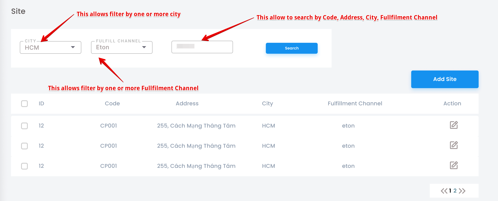

# API Design Guide
(c) 2020 Tran Phong Phu - vietean@gmail.com

## Problems Statement

Many services have a list API to serve a function to list all items in a service. This API allows input params: pagination info, search, filter.

But now, we have some designs that do not have the same layout and functionality. So make the user experience confused for every feature. Only about the UX concerns, that also leads to make the List APIs are designed too different

So we need to have a guide to make a standard.

## Benefits

- BA/Designer will have background knowledge to design the listing feature.
- Backend/Frontend developers will have the same interface to communicate with.
- Users will receive the same experiences on our products.

## Get API

### Request Explanation

A List API should be input 2 major inputs like the below table

| # | Name  | Requirement | Description  |
|---|---|---|---|
| 1 | Owner<sup>[1]</sup>  | Required  | Data owner, eg: Seller, User ...  |
| 2 | ID | Required  | A text to search in data  |


### Response Explanation

The response should be simple is: found or not found.

**In case found**, it should response the object data such as `Product`, `User`, `Order`

**In case not found**, it should response `Status 404`.

### Example

Here is a recommendation to help you design GET API.

```proto
rpc GetBook(ProductRequest) returns (ProductResponse) {
  option (google.api.http) = {
    get: "/v1/product/{id}"
  };
}

message ProductRequest{
   int32 id = 1;
   int32 seller_id = 2;
}

message Product{
   int32 id = 1;
   string sku = 2;
   string name = 3;
   repeated Category categories = 5;
   double price = 6;
   double promoted_price = 7;
   int32 seller_id = 100;
}

message Category {
   int32 id = 1;
   string name = 2;
   string path = 3;
}
```

Here is not a good example, you should avoid and don't do this.

```proto
rpc GetBook(ProductRequest) returns (ProductResponse) {
  option (google.api.http) = {
    get: "/v1/product/{id}"
  };
}

message ProductRequest{
   int32 id = 1;
   int32 seller_id = 2;
}

message ProductResponse{
   Product product = 1;
   bool success = 2;
   string error = 2;
   string message = 4;
}
```

## Create API

### Request Explanation

A List API should be input 3 major inputs like the below table

| # | Name  | Requirement | Description  |
|---|---|---|---|
| 1 | Owner<sup>[1]</sup>  | Required  | Data owner, eg: Seller, User ...  |
| 2 | Creator | Required  | Who is create data  |
| 3 | Data | Required  | All data to create  |

### Data Validation Explanation

The server should validate all data to make sure that are all valid to process. You MUST NOT think that the client (browser, FE could do that, no need do at server), that is a security problem.

### Syntax Validation

We image that about syntax rules such as:

| # | Type  | Requirement | Description  |
|---|---|---|---|
| 1 | Numerics  | Required  | Min, Max, Equal, one of value of Enum  |
| 2 | String | Required  | Min length, Max length  |
| 3 | Email | Required  | Email rule  |
| 4 | Phone Number | Required  | Phone rule  |
| ... | ... | ...  | ...  |

### Business Rule Validation

We image that about syntax rules such as:

| # | Type  | Requirement | Description  |
|---|---|---|---|
| 1 | Unique  | Required  | Check the data is exist or not  |
| ... | ... | ...  | ...  |

### Data Sanitize

Due to security reasons, we should to sanitize data before processing (eg: persist data to storage) to avoid SQL injection, or XSS attack.

Data sanitize means that we remove all unnecessary characters and keep only valid characters.

About product we could to use Markdown Editor to avoid HTML Editor to help to protect vulnerability problems.

### Response Explanation

The response should be simple is: success or failed.

**In case found**, it should response the object data such as Product, User, Order... primary key.

**In case failed**, it should response `Status 400` for bad request.

### Examples

```proto
rpc CreateProduct(CreateProductRequest) returns (Product) {
  option (google.api.http) = {
    post: "/v1/product",
    body: "*"
  };
}

message CreateProductRequest{
   int32 seller_id = 1;
   int32 user_id = 2;
   Product product = 3;
}

message Product{
   int32 id = 1;
   string sku = 2 [(validate.rules).string.len = 10];
   string name = 3 [(validate.rules).string = {min_len: 10, max_len: 256}];
   int32 category_id = 5;
   double price = 6 [(validate.rules).int32.gt = 0];
   // promoted_price should less than price could validate in code
   double promoted_price = 7 [(validate.rules).int32.gt = 0];
}
```

## Update API

### Request Explanation

A List API should be input 3 major inputs like the below table

| # | Name  | Requirement | Description  |
|---|---|---|---|
| 1 | Owner<sup>[1]</sup>  | Required  | Data owner, eg: Seller, User ...  |
| 2 | Resource ID | Required  | What is the resource to be updated  |
| 3 | Data | Required  | The data to update  |

You should have validate, sanitize data as Create API.

**Avoid IDOR issues**, you should check the `Resource ID` is belongs to the Owner.

### Response Explanation

The response should be simple is: success or failed.

**In case found**, it should response the object data such as Product, User, Order... primary key.

**In case failed**, it should response `Status 404` not found or `Status 400` for bad request.

### Examples

```proto
rpc CreateProduct(UpdateProductRequest) returns (Product) {
  option (google.api.http) = {
      put: "/v1/product/{id}",
      body: "*"
  };
}

message UpdateProductRequest{
   int32 seller_id = 1;
   Product product = 3;
   // The list of fields to be updated.
   google.protobuf.FieldMask update_mask = 2;
}

message Product{
   int32 id = 1;
   string sku = 2 [(validate.rules).string.len = 10];
   string name = 3 [(validate.rules).string = {min_len: 10, max_len: 256}];
   int32 category_id = 5;
   double price = 6 [(validate.rules).int32.gt = 0];
   // promoted_price should less than price could validate in code
   double promoted_price = 7 [(validate.rules).int32.gt = 0];
}
```

## Delete API

### Request Explanation

A List API should be input 2 major inputs like the below table

| # | Name  | Requirement | Description  |
|---|---|---|---|
| 1 | Owner<sup>[1]</sup>  | Required  | Data owner, eg: Seller, User ...  |
| 2 | Resource ID | Required  | What is the resource to be deleted  |

**Avoid IDOR issues**, you should check the `Resource ID` is belongs to the Owner.

### Response Explanation

The response should be simple is: success or failed.

**In case found**, it should response an empty object.

**In case failed**, it should response `Status 404` not found or `Status 400` for bad request.

### Examples

```proto
rpc CreateProduct(UpdateProductRequest) returns (google.protobuf.Empty) {
  option (google.api.http) = {
      DELETE: "/v1/product/{id}"
  };
}
```

## List API

#### Request Explanation

A List API should be input 5 major inputs like the below table


| # | Name  | Requirement | Description  |
|---|---|---|---|
| 1 | Owner<sup>[1]</sup>  | Required  | Data owner, eg: Seller, User ...  |
| 2 | Search | Optional  | A text to search in data  |
| 3 | Filters | Optional  | A group of info used to filter data  |
| 4 | Pagination  | Required/Default  | To get data per page, default should fit on the screen of the device.  |
| 5 | Sort  | Required/Default  | To sort the data, default should by ID/CreatedAt (DESC)  |


##### Owner Parameter

Any private data (such as Order, Stock, Warehouse …) that need the Owner info.
If for this current user, we could use the token to get the Identity of the current user.
If for a seller, for some reasons some user has more than one seller so the client should send from the client. Then the Backend will verify that the seller belongs to the current user, but the Backend side should not make assumptions about the seller.

##### Search Parameter

API should provide search features  that allow users to quickly browse to the data without entering correctly information. That allows the user to just use wildcard, prefix, suffix to do to search on all text columns. That means users can search everything that they see on the list.

##### Filter Parameter

For list data, users could filter by one or more columns, the columns to do to search on all text columns. That means users can search everything that they see on the list. allowed input one or more values.

##### Pagination Parameter

There are 2 solutions to design pagination parameter

**First**

For small data, we could use the pair of struct {page, size] to seek any offset of the data.

**Second**

For large data, we could use the struct [next/previous, size] to scroll the data.

#### API Response Explanation

The response of API should contain:

| # | Name  | Requirement | Description  |
|---|---|---|---|
| 1 | Data  | Required  | A collection of result of data, if not found it should return a empty array, should NOT null  |
| 2 | Total | Optional  | Total results are found. Should consider if you want to provide this, with count all results may be a performance issues  |
| 3 | Next | Optional  | With scroll solution: the `next` used to provide info to get next iterator of results.  |
| 4 | Previous  | Optional  | With scroll solution: the `previous` used to provide info to get previous iterator of results  |

### Examples

#### The Site features

We could consider this example to see the listing design



So that, the API design should be:

**Service**

```proto
service API {
    rpc ListSites(ListSitesRequest) returns (ListSitesResponse) {
        option (google.api.http) = {
            get : "/api/v1/sites"
        };
    }
}
```

**Option 1: Use Pagination**

```proto
// ListSitesRequest ...
message ListSitesRequest {
   // search used to input the query of search.
   // it should accept the text of code, or city name, fulfillment channel name, or even address ...
   string search = 1;
   // city_ids used to input the list of city ids to filters.
   repeated int32 city_ids = 2;
   // fulfillment_ids used to input the list of fulfillment channel ids to filter.
   repeated int32 fulfillment_ids = 3;
   // sorts used to sort the columns by ASC/DESC (DESC should be default)
   // example: id, or: id:-1, or id:1
   repeated string sorts = 10;
   // pagination ...
   // size of pagination.
   int32 size = 20;
   // page of pagination.
   int32 page = 21;
}
 
// ListSitesResponse ...
message ListSitesResponse {
   // data used to store a list of items of response data.
   repeated Data data = 1;
   // total used to return all founded data with request.
   // Warning: with tables that have a lot of data it MUST be an issue about performance to count.
   int32 total = 2;
}
 
// Data ...
message Data {
   // id ...
   int64 id = 1;
   // ...
   string text = 2;
}
```

**Option 2: Use Scroll**

```proto
// ListSitesRequest ...
message ListSitesRequest {
   // search used to input the query of search.
   // it should accept the text of code, or city name, fulfillment channel name, or even address ...
   string search = 1;
   // city_ids used to input the list of city ids to filters.
   repeated int32 city_ids = 2;
   // fulfillment_ids used to input the list of fulfillment channel ids to filter.
   repeated int32 fulfillment_ids = 3;
   // sorts used to sort the columns by ASC/DESC (DESC should be default)
   // example: id, or: id:-1, or id:1
   repeated string sorts = 10;
   // size
   int32 size = 20;
   // scroll ...
   oneof scroll {
       // next use to get next page
       string next = 21;
       // use to get previous page
       string prev = 22;
   }
}
 
// ListSitesResponse ...
message ListSitesResponse {
   // data used to store a list of items of response data.
   repeated Data data = 1;
   // total used to return all founded data with request.
   // Warning: with tables that have a lot of data it MUST be an issue about performance to count.
   int32 total = 2;
   // next provides how to scroll to the next page.
   int32 next = 3;
   // prev provides how to scroll to the previous page.
   string prev = 4;
}
 
// Data ...
message Data {
   // id ...
   int64 id = 1;
   // ...
   string text = 2;
}
```

### Selected Fields

You don't want select all fields to reduce the bandwidth, it could use a fields to allow input the selected fields. Then we could mutate the response of data.

#### Example

```proto
rpc GetBook(ProductRequest) returns (ProductResponse) {
  option (google.api.http) = {
    get: "/v1/product/{id}"
  };
}

message ProductRequest{
   int32 id = 1;
   int32 seller_id = 2;
   string fields = 3;
}

```


## References

- [Cloud API Design Guide](https://cloud.google.com/apis/design)
- [API Improvement Proposals](https://google.aip.dev)


[1] For only Authentication/Private API